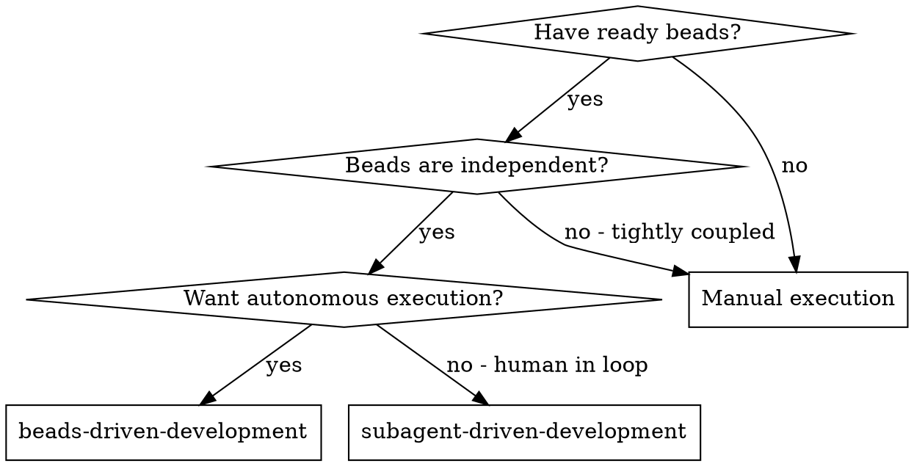
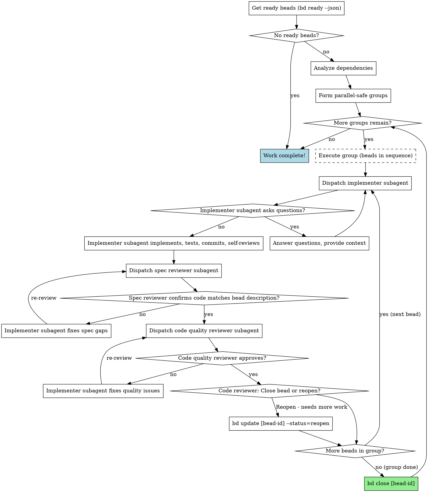

# Beads-Driven Development

Execute ready beads by dispatching a fresh subagent per bead, with two-stage review after each: spec compliance review first, then code quality review. Analyzes dependencies, forms parallel-safe groups, executes group-by-group until no ready beads remain.

**Core principle:** Dependency-aware grouping + fresh subagent per bead + two-stage review (spec then quality) + loop-until-empty = high quality, autonomous execution

## When to Use



**vs. Subagent-Driven Development (plan-based):**
- Reads from beads database (not plan file)
- Loops until no ready beads remain (not fixed task list)
- Closes beads after completion (not TodoWrite)
- Fully autonomous (no human-in-loop during execution)

**vs. Manual MAF workflow:**
- No manual bead claiming or status updates
- Automated review gates
- Continuous execution until empty

## The Process



## Dependency-Aware Grouping

**After getting ready beads, BDD analyzes dependencies and forms parallel-safe groups.**

### Dependency Detection

Beads describe dependencies in their descriptions using patterns like:
- `Depends on: V1-T1, V1-T4`
- `Dependencies: V1-S1, V1-S2, V1-S3`
- `BLOCKED: Waiting for V1 Shadow Spine completion`
- Task numbering (e.g., `V2-T2.3` depends on `V2-T2.1`, `V2-T2.2`)

### Group Formation Algorithm

1. **Parse dependencies** from bead descriptions
2. **Build dependency graph** (bead ID → depends on bead IDs)
3. **Topological sort** into execution groups
4. **Verify no file conflicts** within each group

### Example Output

```
📊 BDD Dependency Analysis

Ready beads: 10
Execution groups: 5

Group 1 (4 beads) - Can execute now (no dependencies):
  1. nextnest-df9 - V2-T2.6-Publish-Gate
     File: lib/ratebook-v2/publish.ts
  2. nextnest-1pg - V2-T2.7-V1-Bridge
     File: lib/ratebook-v2/bridge.ts
  3. nextnest-p93 - V2-T2.8-Table-Rendering
     File: lib/ratebook-v2/rendering.ts
  4. nextnest-6e1 - V2-T2.9-Diff-Utils
     File: lib/ratebook-v2/diff.ts

Group 2 (1 bead) - After Group 1 complete:
  1. nextnest-bad - V2-T2.3-DB-Migrations
     File: supabase/migrations/20250114_create_event_store.sql
     Depends on: V1 completion

Group 3 (2 beads) - After Group 2 complete:
  1. nextnest-ztv - V2-T2.4-Supabase-Store
     File: lib/ratebook-v2/store.ts
     Depends on: V2-T2.3
  2. nextnest-9co - V2-T2.5a-Pure-Rebuild
     File: lib/ratebook-v2/rebuild.ts
     Depends on: V2-T2.4

Group 4 (1 bead) - After Group 3 complete:
  1. nextnest-vlg - V2-T2.10-CLI-Export
     File: scripts/ratebook-v2/export.ts
     Depends on: V2-T2.6

Group 5 (1 bead) - After all groups complete:
  1. nextnest-wwg - V2-T2.11-Integration-Wiring
     File: lib/ratebook-v2/integration.ts
     Depends on: All previous tasks

Starting Group 1 execution...
```

## Prompt Templates

- **Implementer prompt:** Dispatch implementer subagent with bead details (id, title, description, labels)
- **Spec reviewer prompt:** Dispatch spec compliance reviewer subagent (bead description = spec)
- **Code quality reviewer prompt:** Dispatch code quality reviewer subagent

All prompts follow the same pattern as `subagent-driven-development` but use bead data instead of plan task data.

## Example Workflow

```
You: I'm using Beads-Driven Development to execute ready beads.

[Get ready beads: bd ready --json]
[Parse JSON, analyze dependencies, form groups]

━━━━━━━━━━━━━━━━━━━━━━━━━━━━━━━━━━━━━━━━━━━━━━━
📊 Dependency Analysis

Ready beads: 10
Execution groups: 5

Group 1 (4 beads) - No dependencies, safe to execute:
  1. nextnest-df9 - V2-T2.6-Publish-Gate
  2. nextnest-1pg - V2-T2.7-V1-Bridge
  3. nextnest-p93 - V2-T2.8-Table-Rendering
  4. nextnest-6e1 - V2-T2.9-Diff-Utils
━━━━━━━━━━━━━━━━━━━━━━━━━━━━━━━━━━━━━━━━━━━━━━━

Starting Group 1 execution...

━━━━━━━━━━━━━━━━━━━━━━━━━━━━━━━━━━━━━━━━━━━━━━━
📎 Bead 1/4 (Group 1): nextnest-df9 - V2-T2.6-Publish-Gate
━━━━━━━━━━━━━━━━━━━━━━━━━━━━━━━━━━━━━━━━━━━━━━━

[Dispatch implementer subagent with full bead details]

Implementer: "Implementing publish gate..."

[Later] Implementer:
  - Created lib/ratebook-v2/publish.ts
  - Added snapshot validation
  - Tests: 6/6 passing
  - Self-review: All good
  - Committed: abc1234

[Dispatch spec compliance reviewer]
Spec reviewer: ✅ Spec compliant

[Dispatch code quality reviewer]
Code reviewer: ✅ Approved. No issues.

Code reviewer decision: ✅ Close bead
[Execute: bd close nextnest-df9]

━━━━━━━━━━━━━━━━━━━━━━━━━━━━━━━━━━━━━━━━━━━━━━━
📎 Bead 2/4 (Group 1): nextnest-1pg - V2-T2.7-V1-Bridge
━━━━━━━━━━━━━━━━━━━━━━━━━━━━━━━━━━━━━━━━━━━━━━━

[Dispatch implementer subagent]

Implementer: "Implementing V1 bridge..."

[Later] Implementer:
  - Created lib/ratebook-v2/bridge.ts
  - Converts V1 parsed rates to V2 events
  - Tests: 8/8 passing
  - Committed: def5678

[Dispatch spec compliance reviewer]
Spec reviewer: ✅ Spec compliant

[Dispatch code quality reviewer]
Code reviewer: ✅ Approved.

Code reviewer decision: ✅ Close bead
[Execute: bd close nextnest-1pg]

━━━━━━━━━━━━━━━━━━━━━━━━━━━━━━━━━━━━━━━━━━━━━━━
📎 Bead 3/4 (Group 1): nextnest-p93 - V2-T2.8-Table-Rendering
━━━━━━━━━━━━━━━━━━━━━━━━━━━━━━━━━━━━━━━━━━━━━━━

[Dispatch implementer subagent]

Implementer: "Implementing table rendering..."

[Later] Implementer:
  - Created lib/ratebook-v2/rendering.ts
  - Renders Table 1 from V2 state
  - Tests: 5/5 passing
  - Committed: ghi9012

[Dispatch spec compliance reviewer]
Spec reviewer: ❌ Issue:
  - Missing: Column header formatting (mentioned in description)

[Implementer fixes issue]
Implementer: Added column header formatter

[Spec reviewer reviews again]
Spec reviewer: ✅ Spec compliant now

[Dispatch code quality reviewer]
Code reviewer: ✅ Approved.

Code reviewer decision: ✅ Close bead
[Execute: bd close nextnest-p93]

━━━━━━━━━━━━━━━━━━━━━━━━━━━━━━━━━━━━━━━━━━━━━━━
📎 Bead 4/4 (Group 1): nextnest-6e1 - V2-T2.9-Diff-Utils
━━━━━━━━━━━━━━━━━━━━━━━━━━━━━━━━━━━━━━━━━━━━━━━

[Dispatch implementer subagent]

Implementer: "Implementing diff utilities..."

[Later] Implementer:
  - Created lib/ratebook-v2/diff.ts
  - Compares V1 and V2 outputs
  - Tests: 7/7 passing
  - Committed: jkl3456

[Dispatch spec compliance reviewer]
Spec reviewer: ✅ Spec compliant

[Dispatch code quality reviewer]
Code reviewer: ✅ Approved.

Code reviewer decision: ✅ Close bead
[Execute: bd close nextnest-6e1]

━━━━━━━━━━━━━━━━━━━━━━━━━━━━━━━━━━━━━━━━━━━━━━━
✅ Group 1 complete! 4/4 beads executed successfully.

━━━━━━━━━━━━━━━━━━━━━━━━━━━━━━━━━━━━━━━━━━━━━━━
📎 Starting Group 2...

[Get fresh ready beads - dependencies may have unblocked new work]
[Continue with remaining groups...]

━━━━━━━━━━━━━━━━━━━━━━━━━━━━━━━━━━━━━━━━━━━━━━━
✅ Work complete! Executed 10 beads across 5 groups

━━━━━━━━━━━━━━━━━━━━━━━━━━━━━━━━━━━━━━━━━━━━━━━
```

## Advantages

**vs. Manual execution:**
- Subagents follow TDD naturally
- Fresh context per bead (no confusion)
- Continuous execution (no manual bead claiming)
- Review gates automatic

**vs. Subagent-Driven Development:**
- No plan file required
- Works with existing beads workflow
- Loops-until-empty (fire-and-forget)
- Automatic bead closure

**Efficiency gains:**
- No file reading overhead (controller provides bead data)
- Controller curates exactly what context is needed
- Subagent gets complete information upfront
- No human-in-loop during execution

**Quality gates:**
- Self-review catches issues before handoff
- Two-stage review: spec compliance, then code quality
- Review loops ensure fixes actually work
- Spec compliance prevents over/under-building
- Code quality ensures implementation is well-built

## Red Flags

**Never:**
- Skip reviews (spec compliance OR code quality)
- Proceed with unfixed issues
- Dispatch multiple implementation subagents in parallel (conflicts)
- Make subagent read bead database (provide full data instead)
- Ignore subagent questions (answer before letting them proceed)
- Accept "close enough" on spec compliance (spec reviewer found issues = not done)
- Skip review loops (reviewer found issues = implementer fixes = review again)
- Let implementer self-review replace actual review (both are needed)
- **Start code quality review before spec compliance is ✅** (wrong order)
- Move to next bead while either review has open issues

**If subagent asks questions:**
- Answer clearly and completely
- Provide additional context if needed
- Don't rush them into implementation

**If reviewer finds issues:**
- Implementer (same subagent) fixes them
- Reviewer reviews again
- Repeat until approved
- Don't skip the re-review

**If subagent fails bead:**
- Dispatch fix subagent with specific instructions
- Don't try to fix manually (context pollution)

**If code reviewer says reopen:**
- Reopen the bead with notes about what's needed
- Move to next ready bead
- Don't get stuck on one bead

## Integration

**Based on:** `subagent-driven-development` skill (same execution pattern, different data source)

**Required workflow skills:**
- **superpowers:writing-plans** - Creates plans that get converted to beads
- **superpowers:requesting-code-review** - Code review template for reviewer subagents
- **superpowers:finishing-a-development-branch** - Complete development after all beads

**Subagents should use:**
- **superpowers:test-driven-development** - Subagents follow TDD for each bead

**Related skills:**
- **plan-to-beads** - Converts plans to beads (creates the work this executes)
- **subagent-driven-development** - Plan-based variant (use when you have a plan, not beads)

**Related commands:**
- `/bdd` - Slash command to invoke this skill
- `bd ready` - Show ready beads
- `bv --robot-triage` - AI-ranked bead recommendations

## Commands Used

```bash
# Get ready beads (JSON for parsing)
bd ready --json --limit 50

# Close completed bead
bd close [bead-id]

# Reopen bead for more work
bd update [bead-id] --status=reopen --notes="Needs: [reason]"

# Update bead with context
bd update [bead-id] --notes="[implementation notes]"
```

## Version

**Skill Version:** 2.0
**Created:** 2025-01-26
**Updated:** 2025-01-26 (Added dependency-aware grouping)
**Based on:** subagent-driven-development (same pattern, beads data source)
**Status:** Ready for production use

---

**Last Updated:** 2025-01-26
**Workflow:** Beads → Dependency Analysis → Group Formation → Execute Groups → Loop until empty
