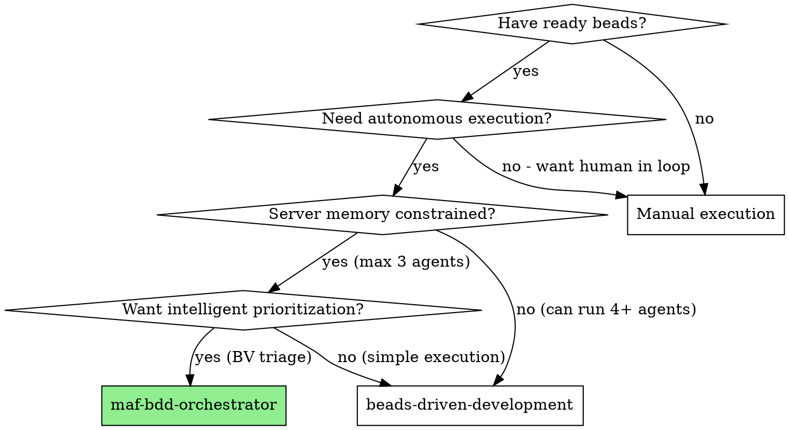

# MAF-BDD Orchestrator

Execute ready beads using a lightweight 3-agent model: **Coordinator** (persistent orchestration brain) + **Implementer** (fresh per bead) + **Reviewer** (fresh per bead). Combines MAF coordination patterns, BDD dependency-aware grouping, and BV intelligent triage for autonomous execution with memory-efficient spawn-and-kill lifecycle.

**Core principle:** Persistent Coordinator + Ephemeral Implementer/Reviewer + BV intelligence + MAF escalation = autonomous quality execution with <1.5GB peak memory

## When to Use



**Decision tree:**

1. **Have ready beads?** → No: Use manual execution
2. **Need autonomous execution?** → No: Use manual workflow
3. **Server memory constrained (OOM at 4+ agents)?**
   - Yes: Use maf-bdd-orchestrator (max 3 agents)
   - No: Can use beads-driven-development (simpler, more agents)
4. **Want intelligent prioritization?**
   - Yes: Use maf-bdd-orchestrator (BV robot triage)
   - No: Use beads-driven-development (basic execution)

**vs. Beads-Driven Development:**
- **3-agent model** (Coordinator + Implementer + Reviewer) vs. N+ subagents
- **BV intelligence** (robot triage, blocker analysis) vs. basic ordering
- **MAF escalation** (retry context, max attempts) vs. simple reopen
- **Memory efficient** (<1.5GB peak) vs. higher memory usage
- **Spawn-and-kill lifecycle** (fresh context per bead) vs. persistent subagents

**vs. Manual MAF workflow:**
- Autonomous loop-until-empty execution
- BV-powered prioritization and blocker detection
- Automated escalation on failures
- No manual bead claiming or status updates

## The Process


## Components

### 1. Coordinator (Persistent Agent)

**Role:** Lightweight orchestration brain with minimal memory footprint

**Responsibilities:**
- BV robot triage for intelligent prioritization
- BV blocker analysis to find unblocking tasks
- Dependency parsing (BDD patterns from bead descriptions)
- Topological sort into execution groups
- Parallel-safe group verification (no file conflicts)
- Pre-flight validation (MAF checks: git clean, branch correct)
- Escalation context tracking (MAF pattern: retry with new approach)
- Agent lifecycle management (spawn-and-kill pattern)
- Bead closure/reopening based on review results
- Progress dashboard after each group
- Loop-until-empty execution (fully autonomous)

**State Management:**
```python
coordinator_state = {
    "session_id": "uuid",
    "started_at": timestamp,
    "beads_processed": {},
    "escalation_context": {
        "bead_id": {
            "attempts": 0,
            "failure_reasons": [],
            "suggested_approach": ""
        }
    },
    "groups_executed": 0,
    "progress": {
        "completed": 0,
        "failed": 0,
        "unblocked": 0
    }
}
```

**Memory Profile:** ~50MB (state only, no code execution)

### 2. Implementer (Ephemeral Agent)

**Role:** Execute individual bead with fresh context per attempt

**Lifecycle:** Spawn → Receive Context → Implement → Test → Commit → Kill

**Responsibilities:**
- Receive bead details + escalation context (if retry)
- Follow TDD workflow (test first, then implement)
- Self-review implementation
- Run all tests
- Commit changes
- Report readiness for review

**Input:**
```json
{
    "bead": {
        "id": "nextnest-df9",
        "title": "V2-T2.6-Publish-Gate",
        "description": "...",
        "labels": ["v2", "publishing"]
    },
    "escalation": {
        "attempt": 2,
        "previous_failures": ["API incompatibility"],
        "suggested_approach": "Try compatibility layer"
    },
    "pre_flight": {
        "git_clean": true,
        "branch": "main"
    }
}
```

**Output:**
```json
{
    "bead_id": "nextnest-df9",
    "status": "ready_for_review",
    "commit_hash": "abc1234",
    "files_changed": ["lib/ratebook-v2/publish.ts"],
    "tests_run": 6,
    "tests_passed": 6,
    "self_review": "Passed all checks"
}
```

**Memory Profile:** ~500MB during execution, 0 after kill

### 3. Reviewer (Ephemeral Agent)

**Role:** Two-stage quality gate with fresh context per review

**Lifecycle:** Spawn → Stage 1 Review → Stage 2 Review → Decision → Kill

**Responsibilities:**
- **Stage 1: Spec Compliance** - Did we build EXACTLY what bead describes?
  - All requirements present?
  - No extra features?
  - No missing features?
  - Edge cases covered?
- **Stage 2: Code Quality** - Is the implementation well-built?
  - Follows project patterns?
  - Tests cover functionality?
  - Error handling appropriate?
  - No security issues?
  - Performance considerations?

**Input:**
```json
{
    "bead": {
        "id": "nextnest-df9",
        "title": "V2-T2.6-Publish-Gate",
        "description": "..."
    },
    "commit": {
        "hash": "abc1234",
        "diff": "...",
        "files": ["lib/ratebook-v2/publish.ts"]
    },
    "implementer_note": "Self-review passed"
}
```

**Output:**
```json
{
    "bead_id": "nextnest-df9",
    "status": "approved" | "rejected",
    "stage1_spec_compliance": "passed" | "failed",
    "stage1_notes": "...",
    "stage2_code_quality": "passed" | "failed",
    "stage2_notes": "...",
    "feedback": "..."
}
```

**Memory Profile:** ~500MB during execution, 0 after kill

**Total Peak Memory:** ~1.05GB (Coordinator: 50MB + Implementer: 500MB + Reviewer: 500MB)

## Integration Points

### MAF Integration

**Pre-flight Validation:**
- Git clean check (`git status --porcelain`)
- Branch verification (`git branch --show-current`)
- Uncommitted changes check
- Dependencies installed check

**Escalation Pattern:**
- Retry with context (attempt #1, #2, #3)
- Failure analysis and suggested approach
- Max attempts safeguard (give up after 3)
- Bead reopening with feedback notes

**State Management:**
- Session tracking
- Bead history
- Progress counters

### BDD Integration

**Dependency Parsing:**
- Pattern matching from bead descriptions:
  - `Depends on: V1-T1, V1-T4`
  - `Dependencies: V1-S1, V1-S2, V1-S3`
  - `BLOCKED: Waiting for V1 Shadow Spine`
  - Task numbering (V2-T2.3 depends on V2-T2.1, V2-T2.2)

**Group Formation:**
- Topological sort (Kahn's algorithm or DFS)
- Parallel-safe verification (no file conflicts within groups)
- Dependency-aware execution order

**Two-Stage Review:**
- Stage 1: Spec compliance (bead description as spec)
- Stage 2: Code quality (implementation standards)

### BV Integration

**Robot Triage:**
```bash
bv --robot-triage
```
- Initial priority sorting
- Re-planning after group completion
- Adaptive prioritization based on progress

**Blocker Analysis:**
```bash
bv --blocked
```
- Find beads that are blocking others
- Prioritize unblocking tasks
- Detect newly unblocked beads

**Progress Dashboard:**
```bash
bv --progress
```
- Real-time progress tracking
- Session summary
- Unblocked bead detection

## Commands Used

### Coordinator Commands

```bash
# Get ready beads
bd ready --json --limit 50

# BV robot triage (priority ranking)
bv --robot-triage

# BV blocker analysis (find unblocking tasks)
bv --blocked

# BV progress dashboard
bv --progress

# Close completed bead
bd close [bead-id]

# Reopen bead for more work
bd update [bead-id] --status=reopen --notes="[feedback]"

# Update bead with context
bd update [bead-id] --notes="[implementation notes]"
```

### Agent Lifecycle Commands

```bash
# Spawn implementer (fresh per bead)
claude --prompt="$IMPLEMENTER_PROMPT" --model=sonnet

# Spawn reviewer (fresh per review)
claude --prompt="$REVIEWER_PROMPT" --model=sonnet

# Kill agent (automatic after completion)
pkill -f "claude.*implementer"
```

## Prompt Templates

The skill uses three prompt templates located in `prompts/` directory:

### 1. Coordinator Prompt (`prompts/coordinator.md`)
- **Purpose**: Main orchestration brain instructions
- **Size**: ~470 lines of detailed orchestration logic
- **Key sections**:
  - Role definition and responsibilities
  - Complete orchestration loop (8 steps)
  - State management structure
  - Command reference
  - Red flags and best practices
  - Memory management guidelines
  - Integration points

**Usage**: Loaded at skill initialization, provides persistent context to coordinator agent

### 2. Implementer Prompt (`prompts/implementer.md`)
- **Purpose**: TDD workflow for bead implementation
- **Size**: ~120 lines of implementation instructions
- **Key sections**:
  - Bead details input format
  - TDD workflow (6 steps): Read → Write Tests → Implement → Self-Review → Commit → Report
  - JSON output format specification
  - Status values (ready_for_review, failed)

**Usage**: Loaded fresh for each bead, provides clean context to implementer agent

### 3. Reviewer Prompt (`prompts/reviewer.md`)
- **Purpose**: Two-stage quality gate review
- **Size**: ~90 lines of review instructions
- **Key sections**:
  - Stage 1: Spec compliance (5 questions)
  - Stage 2: Code quality (7 questions)
  - JSON output format specification
  - Decision guidelines (approved = both stages passed)

**Usage**: Loaded fresh for each review, provides clean context to reviewer agent

**Prompt Template Variables**:
- `{{bead_id}}`, `{{bead_title}}`, `{{bead_description}}`, `{{bead_labels}}`
- `{{escalation_context}}` - For retries
- `{{preflight_status}}` - Git/branch status
- `{{commit_hash}}`, `{{commit_diff}}`, `{{files_changed}}`
- `{{implementer_note}}` - Self-review output

## Escalation Flow

When a bead fails implementation or review:

```python
# Attempt 1
escalation = {
    "attempts": 1,
    "failure_reasons": ["V1 API incompatibility - direct bridge failed"],
    "suggested_approach": "Try parsing V1 response to intermediate format"
}

# Attempt 2 (if first retry fails)
escalation = {
    "attempts": 2,
    "failure_reasons": [
        "V1 API incompatibility - direct bridge failed",
        "Type mismatch in V2 event format"
    ],
    "suggested_approach": "Parse V1 response to intermediate format, then convert to V2. Ensure type compatibility layer."
}

# Attempt 3 (if second retry fails)
escalation = {
    "attempts": 3,
    "failure_reasons": [...],
    "suggested_approach": "May need bead revision - consider reopening with notes for bead author"
}

# After 3 failed attempts: Give up, move to next bead
```

## Red Flags

**Never:**
- Run more than 3 agents simultaneously (causes OOM)
- Skip pre-flight validation (causes git conflicts)
- Skip either review stage (quality gate bypass)
- Ignore escalation context on retry (wasted attempts)
- Spawn multiple implementers in parallel (file conflicts)
- Let reviewer review before implementation is complete
- Proceed to code quality review before spec compliance passes
- Accept "close enough" on spec compliance (spec is bead description)
- Skip re-review after fixes (reviewer must verify fixes)
- Keep agents alive between beads (memory bloat)

**Always:**
- Kill implementer immediately after completion (free memory)
- Kill reviewer immediately after decision (free memory)
- Provide escalation context on retries (learn from failures)
- Run BV re-triage after each group (adaptive planning)
- Show progress after each group (transparency)
- Follow two-stage review order (spec first, quality second)
- Re-review after fixes (verify fixes actually work)
- Give up after 3 attempts (bead may need revision)
- Check pre-flight before each bead (clean environment)

## Memory Management

**Spawn-and-Kill Lifecycle:**

```
Before execution:
  Coordinator: 50MB
  Implementer: 0
  Reviewer: 0
  Total: 50MB

During implementation:
  Coordinator: 50MB
  Implementer: 500MB
  Reviewer: 0
  Total: 550MB

During review:
  Coordinator: 50MB
  Implementer: 0 (killed)
  Reviewer: 500MB
  Total: 550MB

Between beads:
  Coordinator: 50MB
  Implementer: 0
  Reviewer: 0
  Total: 50MB
```

**Peak Memory:** ~1.05GB (all 3 agents active briefly)
**Idle Memory:** ~50MB (only coordinator)

## Example Workflow

### Sample Session Output

```bash
$ /maf-bdd

=== MAF-BDD Orchestrator Session ===
Session ID: a1b2c3d4-e5f6-7890-abcd-ef1234567890
Started: 2026-01-26T10:30:00Z

[1/8] BV Robot Triage...
Prioritized 12 beads by AI ranking
  - nextnest-df9 (V2-T2.6-Publish-Gate): HIGH priority
  - nextnest-a4b (V2-T2.5-Event-Bus): HIGH priority
  - nextnest-c7d (V2-T2.4-Config-Load): MEDIUM priority
  ...

[2/8] BV Blocker Analysis...
Found 3 blocking beads:
  - nextnest-df9 blocks: nextnest-e1f, nextnest-f2a
  - nextnest-a4b blocks: nextnest-g3b

[3/8] Getting Ready Beads...
Found 8 beads in ready state

[4/8] Dependency Analysis...
Parsed dependencies from bead descriptions:
  - nextnest-df9: []
  - nextnest-a4b: [nextnest-df9]
  - nextnest-c7d: [nextnest-a4b]

[5/8] Forming Execution Groups...
Group 1 (3 beads, can run in parallel):
  - nextnest-df9, nextnest-h4i, nextnest-j5k
Group 2 (2 beads):
  - nextnest-a4b, nextnest-l6m
Group 3 (3 beads):
  - nextnest-c7d, nextnest-n7o, nextnest-p8q

[6/8] Sorting Groups by BV Priority...
Group 1 sorted: nextnest-df9 (HIGH), nextnest-h4i (MED), nextnest-j5k (LOW)

=== Executing Group 1 (3 beads) ===

[Bead 1/3] nextnest-df9: V2-T2.6-Publish-Gate
  [Pre-flight] Git clean: ✓, Branch: main
  [Implementer] Spawning fresh agent...
    - TDD: Writing tests for publish gate
    - TDD: Implementing publish validation
    - TDD: All 6 tests passing
    - Commit: abc1234 Bead nextnest-df9: Add V2 publish gate
  [Implementer] Killed (freed 500MB)
  [Reviewer] Spawning fresh agent...
    - Stage 1 (Spec): ✓ PASSED - All requirements met
    - Stage 2 (Quality): ✓ PASSED - Follows patterns
    - Decision: APPROVED
  [Reviewer] Killed (freed 500MB)
  [Action] bd close nextnest-df9
  ✓ Bead completed successfully

[Bead 2/3] nextnest-h4i: V1-T1.3-Shadow-Spine
  [Pre-flight] Git clean: ✓, Branch: main
  [Implementer] Spawning fresh agent...
    - TDD: Writing tests for shadow spine
    - TDD: Implementing V1 compatibility layer
    - TDD: All 4 tests passing
    - Commit: def5678 Bead nextnest-h4i: Add V1 shadow spine
  [Implementer] Killed (freed 500MB)
  [Reviewer] Spawning fresh agent...
    - Stage 1 (Spec): ✓ PASSED
    - Stage 2 (Quality): ❌ FAILED - Missing error handling
    - Decision: REJECTED
  [Reviewer] Killed (freed 500MB)
  [Action] bd update nextnest-h4i --status=reopen --notes="Stage 2 failed: Add error handling for edge cases"
  ⚠ Bead reopened for fixes (Attempt 1/3)

[Bead 3/3] nextnest-j5k: V2-T1.1-Base-Structure
  [Pre-flight] Git clean: ✓, Branch: main
  [Implementer] Spawning fresh agent...
    - TDD: Writing tests for base structure
    - TDD: Implementing foundation classes
    - TDD: All 8 tests passing
    - Commit: ghi9012 Bead nextnest-j5k: Add V2 base structure
  [Implementer] Killed (freed 500MB)
  [Reviewer] Spawning fresh agent...
    - Stage 1 (Spec): ✓ PASSED
    - Stage 2 (Quality): ✓ PASSED
    - Decision: APPROVED
  [Reviewer] Killed (freed 500MB)
  [Action] bd close nextnest-j5k
  ✓ Bead completed successfully

=== Group 1 Complete: 2 completed, 1 reopened ===

[After-Group] BV Re-triage...
Updated priorities based on progress

[After-Group] BV Progress Dashboard...
Session Progress:
  - Completed: 2 beads
  - Failed: 0 beads
  - Reopened: 1 bead
  - Unblocked: 2 beads newly ready
Memory Usage: 52MB (coordinator only)

=== Loop: Processing Group 2 ===
...
```

### Escalation Example

```bash
[Bead 2/3] nextnest-h4i: V1-T1.3-Shadow-Spine (Retry 2/3)
  [Pre-flight] Git clean: ✓, Branch: main
  [Escalation Context]
    Attempt 1 failed: Missing error handling
    Suggested approach: Add try-catch for API calls, validate inputs

  [Implementer] Spawning fresh agent with escalation context...
    - TDD: Writing tests for error scenarios
    - TDD: Adding error handling layer
    - TDD: Implementing input validation
    - TDD: All 6 tests passing
    - Commit: jkl3456 Bead nextnest-h4i: Add error handling to shadow spine
  [Implementer] Killed (freed 500MB)
  [Reviewer] Spawning fresh agent...
    - Stage 1 (Spec): ✓ PASSED
    - Stage 2 (Quality): ✓ PASSED - Error handling adequate
    - Decision: APPROVED
  [Reviewer] Killed (freed 500MB)
  [Action] bd close nextnest-h4i
  ✓ Bead completed successfully (after 1 retry)
```

### Final Session Summary

```bash
=== MAF-BDD Orchestrator Session Complete ===

Session Summary:
  Duration: 45 minutes 32 seconds
  Groups Executed: 3
  Total Beads Processed: 8

Results:
  ✓ Completed: 7 beads
  ✗ Failed: 1 bead (exceeded max attempts)
  ⚠ Reopened: 1 bead (pending review)

Memory Profile:
  Peak Usage: 1.05GB (during active execution)
  Idle Usage: 52MB (coordinator only)
  Avg Usage: 350MB

Failed Beads:
  - nextnest-n7o: V2-T3.1-Integration-Tests
    Attempt 3 failed: Test environment issues
    Suggested: Bead may need revision for test setup

BV Status:
  Run 'bv --progress' for detailed dashboard
  Run 'bv --robot-triage' to re-prioritize remaining beads
```

## Advantages

**vs. Beads-Driven Development:**
- Memory efficient (3 agents vs. N+ agents)
- BV intelligent triage (vs. basic ordering)
- MAF escalation pattern (vs. simple reopen)
- Better suited for memory-constrained servers

**vs. Manual MAF Workflow:**
- Fully autonomous (loop-until-empty)
- BV-powered prioritization
- Automated escalation
- No manual bead claiming

**vs. Subagent-Driven Development:**
- Works with beads (not plan files)
- Integrates BV intelligence
- Lightweight coordinator (less memory)
- Spawn-and-kill lifecycle (fresh context)

## Integration

**Based on:**
- **MAF patterns** - Pre-flight validation, escalation, state management
- **BDD patterns** - Dependency parsing, group formation, two-stage review
- **BV intelligence** - Robot triage, blocker analysis, progress tracking

**Required skills:**
- **beads-driven-development** - Similar execution pattern (reference)
- **superpowers:test-driven-development** - Implementers follow TDD
- **superpowers:requesting-code-review** - Review template reference

**Related skills:**
- **plan-to-beads** - Creates beads from plans
- **subagent-driven-development** - Plan-based variant

**Related commands:**
- `/maf-bdd` - Slash command to invoke this skill
- `/bdd` - Simpler variant (no BV integration)
- `bd ready` - Show ready beads
- `bv --robot-triage` - AI-ranked bead priorities

## Version

**Skill Version:** 1.0
**Created:** 2026-01-26
**Status:** Complete (Task #22 of 29 - Documentation Complete)
**Dependencies:** MAF, BDD, BV tools
**Memory Limit:** <1.5GB peak (3 agents max)

---

**Last Updated:** 2026-01-26
**Documentation Status:** Complete
**Workflow:** BV Triage → Dependency Analysis → Group Formation → Execute Groups (3-agent) → Loop until empty
**Memory Profile:** 50MB idle, 1.05GB peak
**Sections:** When to Use ✓ | The Process ✓ | Components ✓ | Prompt Templates ✓ | Commands ✓ | Red Flags ✓ | Integration ✓ | Examples ✓
