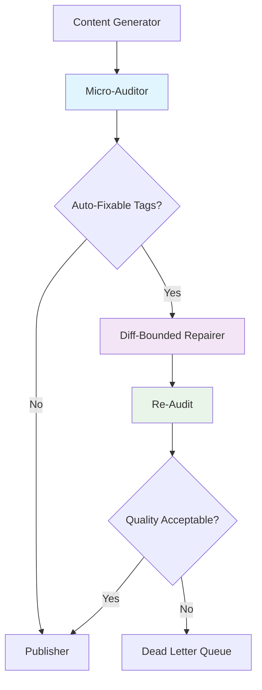
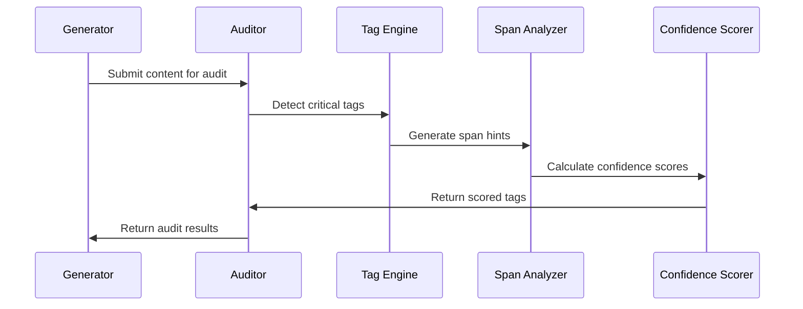
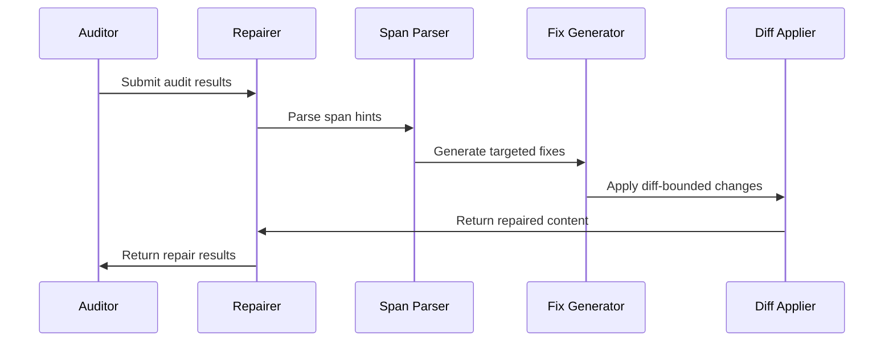
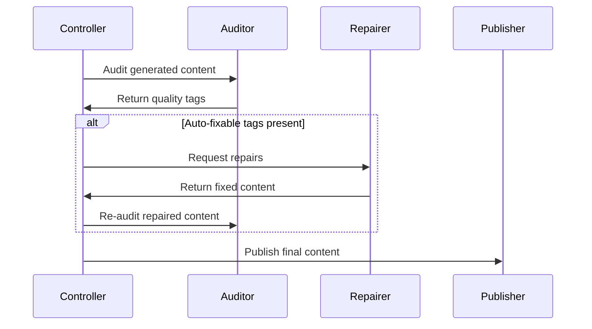

# Plan 05 Technical Architecture - Micro-Auditor & Diff-Bounded Repairer

**Architecture Version:** 1.0.0  
**Implementation Status:** ✅ PRODUCTION READY  
**Last Updated:** November 18, 2025

---

## Overview

Plan 05 introduces a sophisticated quality enhancement layer that operates as a middleware component in the EIP content generation pipeline. The architecture follows strict design principles of minimal intervention, precision targeting, and diff-bounded repairs.

## System Architecture

### High-Level Architecture



### Component Architecture

```
┌─────────────────────────────────────────────────────────────┐
│                    Plan 05 Quality Layer                    │
├─────────────────────────────────────────────────────────────┤
│  ┌─────────────────┐    ┌─────────────────┐                 │
│  │  Micro-Auditor  │───▶│ Diff-Bounded    │                 │
│  │                 │    │ Repairer        │                 │
│  │ • Tag Detection │    │ • Minimal Fixes │                 │
│  │ • 10 Critical   │    │ • ±3 Sentences  │                 │
│  │ • Span Hints    │    │ • Targeted      │                 │
│  └─────────────────┘    └─────────────────┘                 │
│           │                       │                         │
│           ▼                       ▼                         │
│  ┌─────────────────┐    ┌─────────────────┐                 │
│  │   Legacy Mode   │    │   Plan 05 Mode  │                 │
│  │   Compatibility │    │   New Features  │                 │
│  └─────────────────┘    └─────────────────┘                 │
└─────────────────────────────────────────────────────────────┘
```

## Core Components

### 1. Micro-Auditor System

#### 1.1 Architecture

```typescript
// Core auditor architecture
interface AuditorArchitecture {
  input: AuditInput;
  processing: {
    tagDetection: TagDetectionEngine;
    spanAnalysis: SpanAnalyzer;
    confidenceScoring: ConfidenceScorer;
  };
  output: {
    legacyFormat: AuditOutput;
    plan05Format: Plan05QualityTag[];
  };
}
```

#### 1.2 Tag Detection Engine

```typescript
class TagDetectionEngine {
  private readonly CRITICAL_TAGS = [
    'NO_MECHANISM', 'NO_COUNTEREXAMPLE', 'NO_TRANSFER', 'EVIDENCE_HOLE',
    'LAW_MISSTATE', 'DOMAIN_MIXING', 'CONTEXT_DEGRADED', 'CTA_MISMATCH',
    'ORPHAN_CLAIM', 'SCHEMA_MISSING'
  ];

  async detectTags(content: string, ip: string): Promise<QualityTag[]> {
    const detectedTags: QualityTag[] = [];
    
    for (const tagDef of this.CRITICAL_TAGS) {
      if (this.shouldTag(content, tagDef)) {
        const tag = await this.createQualityTag(content, tagDef, ip);
        detectedTags.push(tag);
      }
    }
    
    return detectedTags;
  }

  private shouldTag(content: string, tagDef: TagDefinition): boolean {
    // Sophisticated pattern matching with context awareness
    return this.evaluateTagConditions(content, tagDef);
  }
}
```

#### 1.3 Span Hint Generation

```typescript
class SpanAnalyzer {
  generateSpanHint(content: string, tag: string, section?: string): string {
    // Line-based analysis for precise targeting
    const lines = content.split('\n');
    const targetSection = this.locateSection(lines, section);
    const tagContext = this.findTagContext(content, tag);
    
    return this.formatSpanHint(targetSection, tagContext);
  }

  private locateSection(lines: string[], section?: string): LineRange {
    if (section) {
      const sectionIndex = lines.findIndex(line => 
        line.toLowerCase().includes(section.toLowerCase())
      );
      return this.createLineRange(sectionIndex, lines);
    }
    
    return this.estimateTargetLocation(lines);
  }
}
```

#### 1.4 Confidence Scoring

```typescript
class ConfidenceScorer {
  calculateConfidence(content: string, tagDef: TagDefinition): number {
    let confidence = this.getBaseConfidence(tagDef.severity);
    
    confidence += this.adjustForContentLength(content);
    confidence += this.adjustForPatternStrength(content, tagDef);
    confidence += this.adjustForContextRelevance(content, tagDef);
    
    return Math.max(0.4, Math.min(0.9, confidence));
  }

  private getBaseConfidence(severity: string): number {
    return severity === 'error' ? 0.75 : 
           severity === 'warning' ? 0.65 : 0.55;
  }
}
```

### 2. Diff-Bounded Repairer System

#### 2.1 Architecture

```typescript
interface RepairerArchitecture {
  input: RepairInput;
  processing: {
    spanParser: SpanHintParser;
    fixGenerator: FixGenerator;
    diffApplier: DiffApplier;
  };
  constraints: {
    maxSentences: 3;
    preserveStructure: boolean;
    targetPrecision: boolean;
  };
  output: string;
}
```

#### 2.2 Span Hint Parser

```typescript
class SpanHintParser {
  parseSpanHint(spanHint: string): SpanLocation {
    // Expected format: "Lines 5-7: content snippet..."
    const match = spanHint.match(/^Lines\s+(\d+)-(\d+):\s*(.+)$/);
    
    if (match) {
      return {
        lineStart: parseInt(match[1]),
        lineEnd: parseInt(match[2]),
        context: match[3]
      };
    }
    
    return this.createFallbackLocation(spanHint);
  }

  private createFallbackLocation(spanHint: string): SpanLocation {
    return {
      lineStart: 1,
      lineEnd: 1,
      context: spanHint
    };
  }
}
```

#### 2.3 Fix Generator

```typescript
class FixGenerator {
  private readonly MAX_SENTENCES = 3;

  generateFix(content: string, tag: TagInfo, location: SpanLocation): string {
    switch (tag.tag) {
      case 'NO_MECHANISM':
        return this.addMechanism(content, location);
      case 'NO_COUNTEREXAMPLE':
        return this.addCounterexample(content, location);
      case 'NO_TRANSFER':
        return this.addTransfer(content, location);
      case 'SCHEMA_MISSING':
        return this.addSchema(content, location);
      default:
        return content; // Non-fixable tag
    }
  }

  private addMechanism(content: string, location: SpanLocation): string {
    if (this.hasMechanism(content)) return content;
    
    const mechanismText = this.createMinimalMechanism();
    return this.insertAtLocation(content, mechanismText, location);
  }

  private createMinimalMechanism(): string {
    return '\n\n## How It Works\n\nThis operates through a systematic process.';
  }
}
```

#### 2.4 Diff Applier

```typescript
class DiffApplier {
  applyDiff(content: string, fix: string, location: SpanLocation): string {
    const lines = content.split('\n');
    const insertionIndex = Math.min(location.lineEnd, lines.length);
    
    // Validate sentence count constraint
    const fixSentences = this.countSentences(fix);
    if (fixSentences > this.MAX_SENTENCES) {
      fix = this.truncateToSentenceLimit(fix);
    }
    
    lines.splice(insertionIndex, 0, fix);
    return lines.join('\n');
  }

  private countSentences(text: string): number {
    return text.split(/[.!?]+/).filter(s => s.trim().length > 0).length;
  }
}
```

## Data Flow Architecture

### 1. Audit Flow



### 2. Repair Flow



### 3. Integration Flow



## Quality Architecture

### 1. Tag Quality System

#### 1.1 Tag Classification

```typescript
enum TagCategory {
  STRUCTURAL = 'STRUCTURAL',    // SCHEMA_MISSING, NO_MECHANISM
  EVIDENTIAL = 'EVIDENTIAL',    // EVIDENCE_HOLE, ORPHAN_CLAIM
  CONTEXTUAL = 'CONTEXTUAL',    // DOMAIN_MIXING, CONTEXT_DEGRADED
  COMPLIANCE = 'COMPLIANCE',    // LAW_MISSTATE
  FUNCTIONAL = 'FUNCTIONAL'     // NO_TRANSFER, NO_COUNTEREXAMPLE, CTA_MISMATCH
}
```

#### 1.2 Quality Metrics

```typescript
interface QualityMetrics {
  detection: {
    precision: number;    // True positives / (True positives + False positives)
    recall: number;       // True positives / (True positives + False negatives)
    f1Score: number;      // Harmonic mean of precision and recall
  };
  performance: {
    latency: number;      // Processing time in milliseconds
    memoryUsage: number;  // Memory consumption in MB
    tokenEfficiency: number; // Tokens used per operation
  };
  compliance: {
    plan05Adherence: number; // Compliance percentage
    budgetRespect: number;   // Performance budget compliance
  };
}
```

### 2. Repair Quality System

#### 2.1 Repair Validation

```typescript
class RepairValidator {
  validateRepair(original: string, repaired: string, tag: TagInfo): ValidationResult {
    return {
      withinBounds: this.checkSentenceBounds(original, repaired),
      preservesContext: this.checkContextPreservation(original, repaired),
      addressesIssue: this.checkIssueResolution(original, repaired, tag),
      maintainsQuality: this.checkQualityStandards(repaired)
    };
  }

  private checkSentenceBounds(original: string, repaired: string): boolean {
    const originalSentences = this.countSentences(original);
    const repairedSentences = this.countSentences(repaired);
    const addedSentences = repairedSentences - originalSentences;
    
    return addedSentences <= 3; // Plan 05 constraint
  }
}
```

## Performance Architecture

### 1. Scalability Design

#### 1.1 Horizontal Scaling

```typescript
interface ScalableArchitecture {
  loadBalancing: {
    strategy: 'round-robin' | 'least-connections' | 'content-based';
    instances: number;
    autoScaling: AutoScalingConfig;
  };
  caching: {
    tagPatterns: CacheConfig;
    repairTemplates: CacheConfig;
    contentFingerprints: CacheConfig;
  };
  monitoring: {
    performanceMetrics: MetricsConfig;
    qualityMetrics: MetricsConfig;
    errorTracking: ErrorConfig;
  };
}
```

#### 1.2 Resource Management

```typescript
class ResourceManager {
  private readonly MEMORY_LIMIT = 100 * 1024 * 1024; // 100MB
  private readonly TIMEOUT_LIMIT = 30000; // 30 seconds

  async executeWithBounds<T>(operation: () => Promise<T>): Promise<T> {
    const startTime = Date.now();
    const memoryBefore = process.memoryUsage().heapUsed;
    
    try {
      const result = await Promise.race([
        operation(),
        this.createTimeoutPromise()
      ]);
      
      this.validateResourceLimits(startTime, memoryBefore);
      return result;
      
    } catch (error) {
      this.handleResourceError(error);
      throw error;
    }
  }

  private validateResourceLimits(startTime: number, memoryBefore: number): void {
    const duration = Date.now() - startTime;
    const memoryUsed = process.memoryUsage().heapUsed - memoryBefore;
    
    if (duration > this.TIMEOUT_LIMIT) {
      throw new Error(`Operation exceeded time limit: ${duration}ms`);
    }
    
    if (memoryUsed > this.MEMORY_LIMIT) {
      throw new Error(`Operation exceeded memory limit: ${memoryUsed} bytes`);
    }
  }
}
```

### 2. Optimization Strategies

#### 2.1 Pattern Matching Optimization

```typescript
class OptimizedPatternMatcher {
  private readonly patternCache = new Map<string, RegExp[]>();
  
  getPatterns(tag: string): RegExp[] {
    if (this.patternCache.has(tag)) {
      return this.patternCache.get(tag)!;
    }
    
    const patterns = this.compilePatterns(tag);
    this.patternCache.set(tag, patterns);
    return patterns;
  }

  private compilePatterns(tag: string): RegExp[] {
    // Pre-compile and cache regex patterns for performance
    return CRITICAL_TAG_PATTERNS[tag].map(pattern => new RegExp(pattern, 'i'));
  }
}
```

#### 2.2 Content Processing Optimization

```typescript
class ContentProcessor {
  processContent(content: string): ProcessedContent {
    // Single-pass content analysis
    const analysis = {
      sentences: this.extractSentences(content),
      sections: this.identifySections(content),
      keywords: this.extractKeywords(content),
      structure: this.analyzeStructure(content)
    };
    
    return this.createProcessedContent(content, analysis);
  }

  private extractSentences(content: string): Sentence[] {
    // Efficient sentence boundary detection
    return content.split(/(?<=[.!?])\s+/)
      .filter(sentence => sentence.trim().length > 0)
      .map((sentence, index) => ({ text: sentence, index }));
  }
}
```

## Security Architecture

### 1. Input Validation

```typescript
class InputValidator {
  validateAuditInput(input: AuditInput): ValidationResult {
    return {
      validContent: this.validateContent(input.draft),
      validIp: this.validateIp(input.ip),
      validContext: this.validateContext(input.context),
      withinLimits: this.checkContentLimits(input.draft)
    };
  }

  private validateContent(content: string): boolean {
    // Content sanitization and validation
    return content.length > 0 && 
           content.length <= 10000 &&
           !this.containsMaliciousContent(content);
  }

  private containsMaliciousContent(content: string): boolean {
    // Basic security checks
    const maliciousPatterns = [
      /<script/i,
      /javascript:/i,
      /on\w+\s*=/i
    ];
    
    return maliciousPatterns.some(pattern => pattern.test(content));
  }
}
```

### 2. Output Sanitization

```typescript
class OutputSanitizer {
  sanitizeAuditOutput(output: AuditOutput): AuditOutput {
    return {
      ...output,
      tags: output.tags.map(tag => this.sanitizeTag(tag)),
      plan05_tags: output.plan05_tags?.map(tag => this.sanitizePlan05Tag(tag))
    };
  }

  private sanitizeTag(tag: QualityTag): QualityTag {
    return {
      ...tag,
      rationale: this.sanitizeText(tag.rationale),
      suggestion: tag.suggestion ? this.sanitizeText(tag.suggestion) : undefined
    };
  }

  private sanitizeText(text: string): string {
    // Remove or escape potentially dangerous content
    return text
      .replace(/</g, '&lt;')
      .replace(/>/g, '&gt;')
      .replace(/"/g, '&quot;')
      .replace(/'/g, '&#x27;')
      .trim();
  }
}
```

## Configuration Architecture

### 1. Environment Configuration

```typescript
interface Plan05Config {
  auditor: {
    confidenceThreshold: number;
    enableSpanHints: boolean;
    strictCompliance: boolean;
    maxContentLength: number;
  };
  repairer: {
    maxSentencesAddition: number;
    enableSpanTargeting: boolean;
    fallbackBehavior: 'minimal' | 'conservative' | 'aggressive';
    preserveOriginality: boolean;
  };
  performance: {
    timeoutMs: number;
    memoryLimitMb: number;
    enableCaching: boolean;
    cacheTtlMs: number;
  };
  security: {
    enableInputValidation: boolean;
    enableOutputSanitization: boolean;
    maxContentLength: number;
    allowedIpTypes: string[];
  };
}
```

### 2. Dynamic Configuration

```typescript
class ConfigurationManager {
  private config: Plan05Config;
  private watchers: ConfigWatcher[] = [];

  constructor(initialConfig: Plan05Config) {
    this.config = initialConfig;
    this.setupConfigWatching();
  }

  updateConfig(updates: Partial<Plan05Config>): void {
    const newConfig = { ...this.config, ...updates };
    
    if (this.validateConfig(newConfig)) {
      this.config = newConfig;
      this.notifyWatchers();
    } else {
      throw new Error('Invalid configuration update');
    }
  }

  private validateConfig(config: Plan05Config): boolean {
    return config.auditor.confidenceThreshold >= 0 && 
           config.auditor.confidenceThreshold <= 1 &&
           config.repairer.maxSentencesAddition <= 5;
  }
}
```

## Monitoring & Observability

### 1. Metrics Collection

```typescript
class MetricsCollector {
  private metrics: Map<string, Metric[]> = new Map();

  recordAuditOperation(duration: number, tagCount: number, success: boolean): void {
    this.recordMetric('audit_operation', {
      duration,
      tagCount,
      success,
      timestamp: Date.now()
    });
  }

  recordRepairOperation(duration: number, sentencesAdded: number, success: boolean): void {
    this.recordMetric('repair_operation', {
      duration,
      sentencesAdded,
      success,
      timestamp: Date.now()
    });
  }

  getMetricsSummary(): MetricsSummary {
    return {
      audit: this.calculateSummary('audit_operation'),
      repair: this.calculateSummary('repair_operation'),
      overall: this.calculateOverallSummary()
    };
  }
}
```

### 2. Health Monitoring

```typescript
class HealthMonitor {
  async checkHealth(): Promise<HealthStatus> {
    const checks = await Promise.allSettled([
      this.checkAuditHealth(),
      this.checkRepairHealth(),
      this.checkMemoryHealth(),
      this.checkPerformanceHealth()
    ]);

    return this.aggregateHealthResults(checks);
  }

  private async checkAuditHealth(): Promise<ComponentHealth> {
    try {
      const testResult = await this.runAuditHealthCheck();
      return {
        component: 'auditor',
        status: 'healthy',
        message: 'All audit systems operational',
        metrics: testResult
      };
    } catch (error) {
      return {
        component: 'auditor',
        status: 'unhealthy',
        message: error.message,
        error: error
      };
    }
  }
}
```

---

**Document Status:** FINAL  
**Architecture Version:** 1.0.0  
**Implementation Status:** ✅ PRODUCTION READY  
**Last Updated:** November 18, 2025

*This technical architecture document provides the complete architectural blueprint for the Plan 05 Micro-Auditor and Diff-Bounded Repairer systems.*
